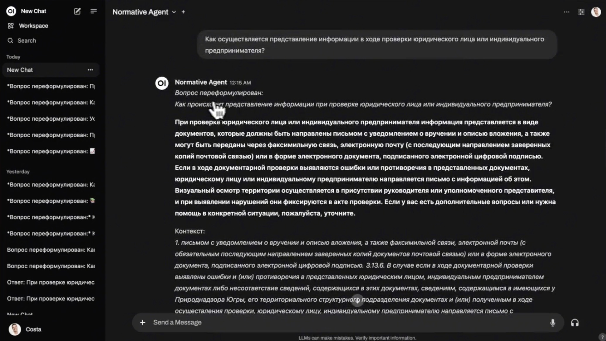

# 🗂️ QnA чат-бот на основе базы знаний


### 📖 Описание проекта
Добро пожаловать в **Automated Legal Document Retrieval System** — современное решение для автоматизированного поиска и обработки юридической информации. Наша система разработана для крупных организаций, чтобы упростить и ускорить доступ к нормативным актам, корпоративной документации и правовой информации, делая её доступной и понятной для всех сотрудников. Теперь каждый сможет быстро находить точные ответы на свои вопросы, без необходимости глубоко погружаться в юридические тексты.




---

### 🚩 Проблема
В организациях с сотнями нормативно-правовых документов становится крайне сложно эффективно находить нужную информацию. Это может создавать ненужные задержки и нагрузку на HR и юридические отделы, замедляя процесс адаптации новых сотрудников и затрудняя поиск информации о льготах и корпоративных правах. Наша система решает эту задачу, предоставляя интуитивный, быстрый и надежный способ навигации по сложной юридической информации.

---

### 🎯 Ключевые преимущества для компаний
- **🔍 Эффективный поиск документов**: Мощные эмбеддинги позволяют мгновенно находить релевантные правовые тексты, даже в больших объемах данных.
- **💡 Контекстно-зависимая генерация**: Ответы формируются с учётом нормативного контекста, что обеспечивает их точность и релевантность.
- **🌐 Интуитивный интерфейс**: Простое и удобное взаимодействие с системой через веб-интерфейс, доступное каждому пользователю.
- **💼 Экономия времени и ресурсов**: Быстрый поиск информации позволяет разгрузить HR и юридические отделы, предоставляя сотрудникам точные ответы за считанные секунды.
- **📊 Масштабируемость и надежность**: Возможность загружать и обновлять неограниченное количество разнородных документов на базе ChromaDB, что делает решение идеальным для крупных организаций.
- **📘 Снижение порога вхождения**: Сотрудники любого уровня могут легко использовать систему, получая доступ к юридической информации на понятном и интуитивном интерфейсе.
- **⚙️ Гибкость и адаптивность**: Микросервисная архитектура легко интегрируется в корпоративные процессы, а поддержка Multi-Query обеспечивает точный поиск даже для сложных запросов.

---

## 💼 Почему стоит выбрать наше решение?

1. **🎓 Специализация на нормативном контенте**: Наша система обучена для работы именно с правовыми документами и использует специально дообученные модели.
2. **⚙️ Настраиваемость**: Систему легко адаптировать под конкретные нормативные нужды, изменив корпус данных или подставив другую модель.
3. **🔗 Прозрачность**: Все ответы сопровождаются цитатами и ссылками на исходные документы, повышая доверие и давая возможность быстро перейти к первоисточнику.


---

### 🛠️ Технологические особенности
- **ChromaDB** – Масштабируемая база данных, которая поддерживает хранение больших объемов нормативно-правовых актов и корпоративной документации.
- **RAG пайплайн**: Обеспечивает эффективное извлечение и генерацию текстов, используя передовые эмбеддинги (multilingual-e5-large) и кросс-энкодеры для точного ранжирования.
- **Cross-Encoder** – Улучшает ранжирование ответов, что позволяет быстрее находить наиболее релевантные документы.
- **Микросервисная архитектура** – Легко адаптируется под нужды вашей компании, обеспечивая гибкость и масштабируемость.


## 🛠️ Технологии и архитектура
- **Backend**: FastAPI, LangChain, Ollama
- **Frontend**: React, TypeScript
- **Эмбеддинги**: Sentence Transformers
- **Языковая модель**: Любая open-source языковая модель (Ollama) или модель на основе GPT-4
- **Векторная база данных**: ChromaDB

---

## 🚀 Установка и запуск

## 🚀 Начало работы

### 📋 Предварительные требования
- **Python 3.11+**
- **Docker**

### 📥 Установка
1. **Клонируйте репозиторий**:
   ```bash
   git clone https://https://github.com/Baltsat/qna_rag_system.git
   cd ai-hack-mono
   ```

2. **Настройте переменные окружения**:
   ```bash
   cp open-webui/.env.example open-webui/.env
   # Отредактируйте .env под вашу конфигурацию
   ```

### 🌐 Запуск приложения
1. Запустите приложение с помощью Docker:

    - Запуск WebUI
   ```bash
   docker run -d -p 3000:8080 --add-host=host.docker.internal:host-gateway -v open-webui:/app/backend/data --name open-webui --restart always ghcr.io/open-webui/open-webui:main
   ```

   - Запуск пайплайнов
   Run the Pipelines container:
    ```bash
    docker run -d -p 9099:9099 --add-host=host.docker.internal:host-gateway -v pipelines:/app/pipelines --name pipelines --restart always ghcr.io/open-webui/pipelines:main
    ```
    Connect to Open WebUI:
    Navigate to the Settings > Connections > OpenAI API section in Open WebUI.
    Set the API URL to http://localhost:9099 and the API key to 0p3n-w3bu!. Your pipelines should now be active.

    [!NOTE]
    If your Open WebUI is running in a Docker container, replace localhost with host.docker.internal in the API URL.


2. Откройте браузер и перейдите по адресу `http://localhost:3000`, чтобы начать работу с системой.

**Внимание!** Перед работой необходимо проиндексировать интересующие файлы в ChromaDB используя agent-normative-docs.

---

## 📂 Структура проекта
- **webui-pipelines**: Директория с пайплайнами для работы с Open WebUI. Здесь реализованы RAG-пайплайны для ответа на вопросы пользователей на основе документов и текстов.
- **ai-hack-webui**: Основная директория с интерфейсом приложения.
- **agent-normative-docs**: Директория с реализацией векторной базы данных для поиска и обработки документов нормативно-правовых актов. Для работы системы необходима индексация их в ChromaDB.
- **research**: Директория с исследованиями и наработками, которые использовались при разработке.

---

## 📅 Дорожная карта

- [x] Реализовать базовый RAG-конвейер.
- [x] Разработать пользовательский интерфейс.
- [x] Добавить поддержку документов разных форматов (.docx, .pdf и т. д.).
- [ ] Внедрить фильтрацию и расширенные параметры поиска.
- [ ] Интеграция с платформами для юридических исследований.
- [ ] Реализация API для интеграции с внешними приложениями.
- [ ] Механизм обратной связи для постоянного улучшения.
- [ ] Поддержка многоязычного интерфейса и обработки документов.

---

## 📜 Лицензия и контрибьютинг
Мы приглашаем вас присоединиться к разработке! Ознакомьтесь с руководством по контрибьютингу в [CONTRIBUTING.md](CONTRIBUTING.md). Проект распространяется на условиях [MIT License](LICENSE).

---

> **Наш проект помогает вывести доступ к нормативной информации на новый уровень — быстро, удобно и надёжно!** Присоединяйтесь к нам, чтобы сделать работу с правовыми документами проще и эффективнее.